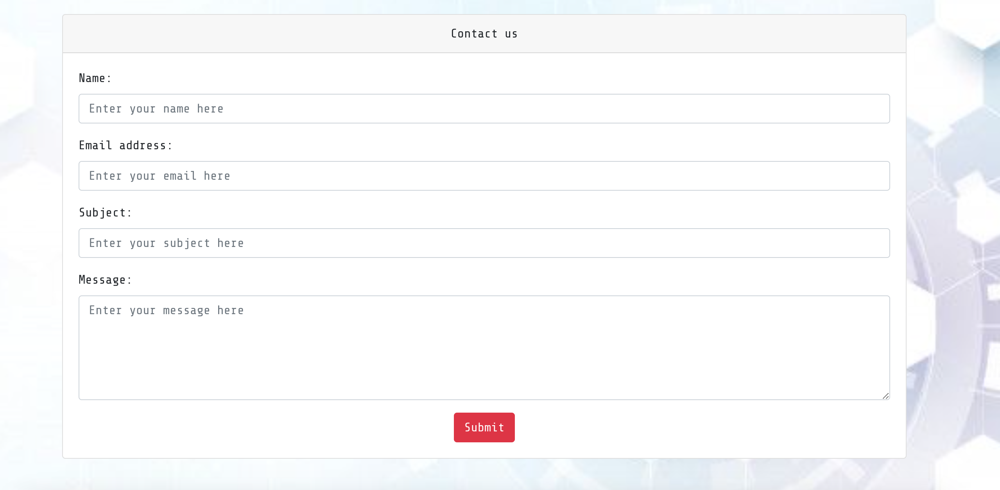

# Innovevent 

Innoevent is a tech networking platform designed to connect professionals across the technology industry. Our mission is to facilitate meaningful interactions and opportunities for collaboration by hosting a wide range of tech events, from workshops and webinars to full-scale conferences. Event organisers are able to share there event with people all accrross the world.

- The repository for the DRF-API associated with this project is available [HERE](https://github.com/DanilleH22/innoevent-drf-api). The installation, set up, and deployment steps for this section of the project have also been included in the README linked to the DRF-API. 

#### DEPLOYED BACKEND API[LINK](https://innoevent-7b1d2e7d15e7.herokuapp.com/)
#### DEPLOYED FRONTEND [LINK - LIVE SITE](https://innoevent-react-93e74f3a4351.herokuapp.com/)
#### DEPLOYED BACKEND GITHUB [REPOSITORY](https://github.com/DanilleH22/innoevent-drf-api)


The live link for "Innovevent" can be found [HERE](https://innoevent-react-93e74f3a4351.herokuapp.com/)

## Table of Contents
+ [UX](#ux "UX") 
  + [Site Purpose](#site-purpose "Site Purpose")
  + [Site Goal](#site-goal "Site Goal")
  + [Audience](#audience "Audience")
  + [Communication](#communication "Communication")
  + [Current User Goals](#current-user-goals "Current User Goals")
  + [New User Goals](#new-user-goals "New User Goals")
+ [User Stories](#user-stories "User Stories")
  + [Admin stories](#admin-stories "Admin stories")
  + [Artist stories](#artist-stories "Artist stories")
  + [Visitor stories](#visitor-stories "Visitor stories")
+ [Design](#design "Design")
  + [Colour Scheme](#colour-scheme "Colour Scheme")
  + [Typography](#typography "Typography")
  + [Imagery](#imagery "Imagery")
+ [Features](#features "Features")
  + [Existing Features](#existing-features "Existing Features")
  + [C.R.U.D](#crud "C.R.U.D")
+ [Testing](#testing "Testing")
  + [Validator Testing](#validator-testing "Validator Testing")
  + [Unfixed Bugs](#unfixed-bugs "Unfixed Bugs")
+ [Technologies Used](#technologies-used "Technologies Used")
  + [Main Languages Used](#main-languages-used "Main Languages Used")
  + [Frameworks, Libraries & Programs Used](#frameworks-libraries-programs-used "Frameworks, Libraries & Programs Used")
+ [Components](#oomponents "Components")
+ [Deployment](#deployment "Deployment")
+ [Credits](#credits "Credits")
  + [Content](#content "Content")
  + [Media](#media "Media")

## UX

### Site Purpose:
To allow people to find networking events about the tech markett near them or virtually.

### Site Goal:
Innovevent is intended to bring together the tech community, so that wheter you are new to tech, or have been in it a while you feel as though you have some support and meet like-minded people.

### Audience:
The audience is for people within the tech niche, from ages 18+.

### Communication:

The layout of the website is to have this networking vibe, whilst still linking to tech. The navigation bar is always present so that you are able to get to whatever tab you need a at a click.

### Current User Goals:
The user goals are for people to find events that they are interested in and would find some type of benefit from.

### New User Goals:
To engage the user in a meaningful way, and allow them to see the world of networking from a different way.

### Future Goals:
- To provide profiles with a list of events they have signed up for.
- To provide profiles with a list of events they have created.
- Users can receive emails of the event they have signed up for.
- Organisers can set up their events to charge a proce for the event
- To expand the events section & provide a google maps location for each event, so that users may understand in more detail where an even is to be hosted.

## User Stories
I have included links to the [GitHub Issues](https://github.com/DanilleH22/innovevent/issues) for this project, as well as the [KANBAN board](https://github.com/users/DanilleH22/projects/9/views/1).


## Design

### Wireframes:

##### Home Page - Desktop: 


##### Home Page - Mobile: 


##### Form Page:


##### Site Navigation:


### Database Schema:
This has been uploaded to the Backend README, which can be found [HERE](https://github.com/DanilleH22/innoevent-drf-api).

### Colour Scheme:

I have used the bootstrap variant 'dark' for the navigation bar. For the buttons I have used the variant 'red'. These two colours together give a technology feel to the website

### Typography:
All fonts were obtained from the Google Fonts library. I chose the following fonts for the page:
1. Share Tech Mono, Monospace

## Features

### Existing Features:


##### Navigation - Desktop:


##### Navigation - Mobile:


#### Events Page:


#### Edit / Delete Page:


#### Create event Form:


#### Contact us Form:



#### Profile:


#### Sign Up For Event:


#### Log in & Sign up:

##### Login:


##### Sign-up:


### Features Left to Implement:
- See events signed up for in profile
- See events created in profile
- Add pictures to the profile
- Organisers can put a video instaed of photo as the thumbnail
- Add social media links for footer

## Testing

### Manual Testing:
1. Test users can sign up for an account.
2. Test users can sign out
3. Test users can sign in if they have already created a account.
4. Events page can be viewed when not logged in but if you want to sign up you are redirected to the sign in page
4. Contact us form works even if not signed in and signed in.
5. Only logged in users can create a event.
6. Only the owner of the event can edit or delete the event.
7. Only the profile owner can update their biography.
8. All nav links open to the correct page.
9. CRUD functionality has been tested for Events


### Validator Testing
1. CSS files pass through the [Jigsaw validator](https://jigsaw.w3.org/css-validator/) with no issues found.


2.  Javascript files has been passed through [ESLint](https://eslint.org/). To my knowledge there are no known ESLint errors as none have been raised.

3. The page has an excellent Accessibility rating in Lighthouse:


4. Tested the site opens in Brave, Chrome, Safari & on a mobile device without issues.

5. All social links open to external pages as intended.

### Unfixed Bugs

To my knowledge there are not known bigs that have been left.

## Technologies Used
### Main Languages Used
- HTML5
- CSS3
- Javascript
- Python
- SQL - Postgres
- React

### Frameworks, Libraries & Programs Used
- Google Fonts : For the site fonts.
- GitPod : To build the project & create the JSX & CSS files before pushing the project to Github.
- GitHub : To store my repository for submission.
- Figma : Was used to create mockups of the project prior to starting.
- Am I Responsive? : To ensure the project looked good across all devices.
- Django : Used to build the backend database that serves as an API for the front-end project.
- React-Bootstrap : The styling library that has aided to the layout of the site, and which was introduced to us during the course of the program.
- DrawSQL : An interactive tool that allows for the creation of Database mock-ups so that we can visualise the relationships between models.
- ReactJS : To build the components that would collectively form the front-end application.

## Components
Several components have been implemented within this project that have been reused throughout the project:
1. axiosDefault.js : for ease of communication with the backend API.
2. Asset.js : to supply photos shown on the homepage and as the background.
3. NavBar.js : to supply the nav bar throughout the website
4. CurrentUserContext.js : confirm users logged-in status to determine what functionality is available to that user.
5. UseClickOutsideToggle.js : when users click outside or on the page they want on smaller screen the nav bar closes.
6. useRedirect.js : redirects a user to another page if they are not authorised to be on the page they are trying to access.

## Deployment
The site was deployed to Heroku. The steps to deploy are as follows:
1. Launch the gitpod workspace.
2. Install ReactJS:
```
npx create-react-app . --use-npm
npm start
```
2. Install the following packages using the command `npm install`:
```
react-bootstrap@1.6.3 bootstrap@4.6.0
react-router-dom@5.3.0
axios
msw --save-dev
jwt-decode
-g eslint
```
3. Git add, commit, and push changes to gitpod.
4. Create the project app on Heroku, and link the GitHub repository by navigating to the 'Deploy' tab.

### Connecting to the API:
1. Navigated to the Heroku app of the project DRF-API, and under the Settings tab, added the following configvars:
- Key: CLIENT_ORIGIN | Value: https://react-app-name.herokuapp.com
- Key: CLIENT_ORIGIN_DEV | Value: https://gitpod-browser-link.ws-eu54.gitpod.io
2. Check that the trailing slash `\` at the end of both links has been removed, and save the configvar pairs.
3. Install the Axios package, & create supporting `axiosDefaults.js` as shown in [Moments Walkthrough](https://github.com/Code-Institute-Solutions/moments/blob/cf955d2f2e6f70f61c92d1f9de85558d8e49f3a8/src/api/axiosDefaults.js).

### Deploy to Heroku:
1. In the `scripts` section of `package.json` in gitpod, added the following command:
```
"heroku-prebuild": "npm install -g serve",
```
2. Add Procfile to project root & populate with the following:
```
web: serve -s build
```
3. Repeat the steps of git add/commit/push.
4. Deploy the project via the deploy button on Heroku.

### Deploy to ElephantSQL:
* The steps I have taken to deploy data to ElephantSQL are linked here [instructions](https://code-institute-students.github.io/deployment-docs/41-pp5-adv-fe/pp5-adv-fe-drf-01-create-a-database)

## Credits

### Content
- Code Institute: The creation of the project came to life by utilising the Moments walkthrough step-by-step as a base foundation, and then building upon it to make the project my own. This is evident from the numerous docstrings within my files crediting the walkthrough.
- My Mentor Lauren for the layout needed for my README

### Media
- Images for the Articles, Events & Posts made on the site have been accumulated from Pexels